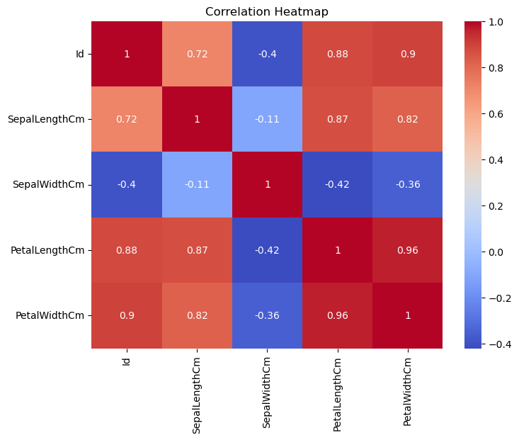
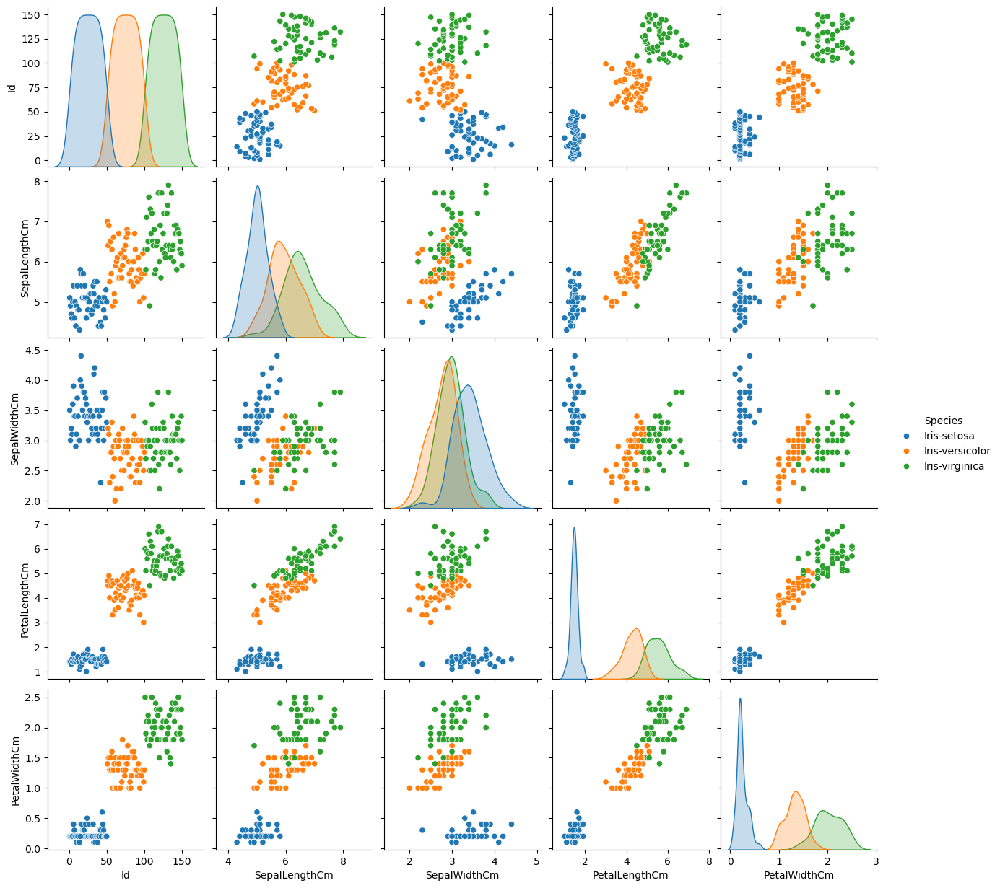

# Task 3: Exploratory Data Analysis (EDA)

## Objective
Perform exploratory data analysis on the Iris dataset using visualization techniques.

## Tools Used
- Python
- Pandas
- Matplotlib
- Seaborn
- Jupyter Notebook

## Dataset
- Iris Dataset

## Tasks Performed
- Generated summary statistics
- Visualized feature distributions
- Created correlation heatmap
- Identified patterns using pairplots
- Analyzed species trends

## Key Findings
- Iris-setosa is clearly distinguishable from the other species.
- Petal length and petal width have strong positive correlation.
- Sepal width shows weaker correlation with other features.
- Species are evenly distributed.
- Petal measurements are highly useful for classification.

## Deliverables
- task3.ipynb
- iris.csv
- README.md

## Visualizations

### Correlation Heatmap

### Pairplot

## Outcome
Successfully explored and visualized the Iris dataset to understand patterns, relationships, and trends.

