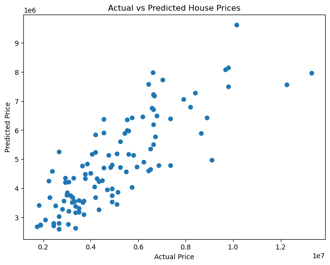

# Task 4: Linear Regression

## Objective

Build a Linear Regression model to predict house prices using the Housing Prices dataset and evaluate its performance using RMSE and R² Score.

## Tools Used

* Python
* Pandas
* NumPy
* Scikit-Learn
* Matplotlib
* Jupyter Notebook

## Dataset

Housing Prices Dataset

### Features

* Area
* Bedrooms
* Bathrooms
* Stories
* Main Road
* Guest Room
* Basement
* Hot Water Heating
* Air Conditioning
* Parking
* Preferred Area
* Furnishing Status

### Target Variable

* Price

## Tasks Performed

1. Loaded and explored the dataset.
2. Converted categorical variables into numerical format using One-Hot Encoding.
3. Split the dataset into training and testing sets.
4. Trained a Linear Regression model.
5. Generated predictions on the test dataset.
6. Evaluated model performance using RMSE and R² Score.
7. Compared Linear Regression with Random Forest Regression.

## Model Performance

### Linear Regression

* RMSE: 1,324,506.96
* R² Score: 0.653

### Random Forest Regression

* RMSE: 1,400,565.97
* R² Score: 0.612

## Observations

* Linear Regression performed better than Random Forest on this dataset.
* The model explained approximately 65% of the variance in house prices.
* House area, number of bathrooms, stories, parking availability, and furnishing status were important factors affecting house prices.
* The dataset appears to have a reasonably linear relationship between features and target values.

## Deliverables

* task4.ipynb
* Housing.csv
* predictions.csv
* README.md
* actual_vs_predicted.png

## Model Visualization

### Actual vs Predicted House Prices

  

The scatter plot compares actual house prices with predicted house prices generated by the Linear Regression model.

## Outcome

Successfully built, trained, and evaluated a Linear Regression model for house price prediction. The project provided practical experience in data preprocessing, model training, prediction, and performance evaluation using machine learning techniques.
